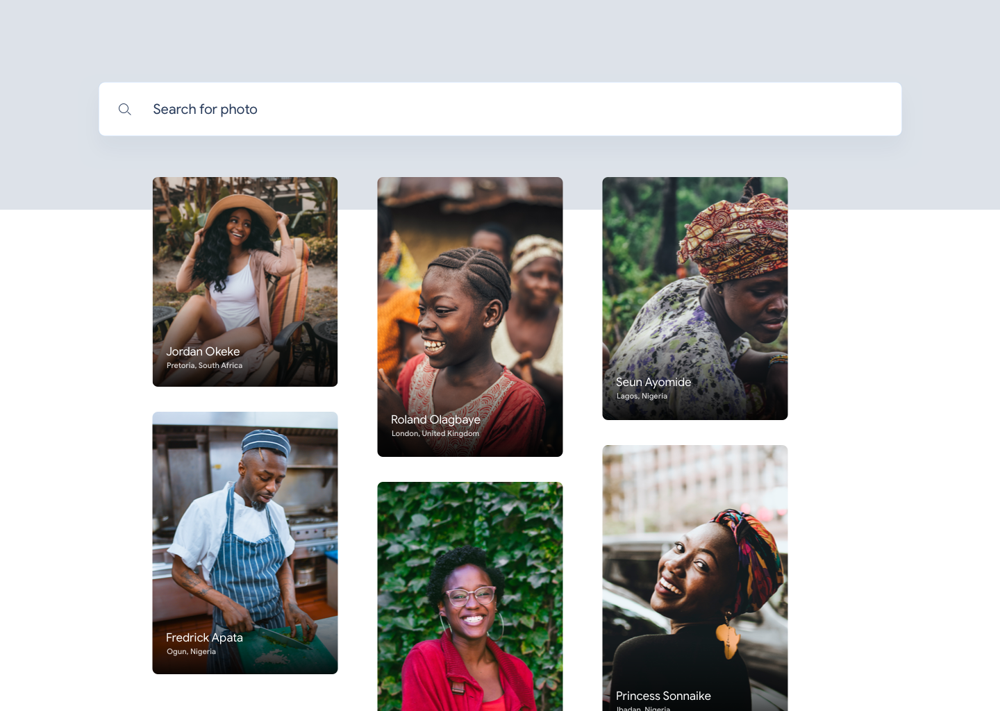
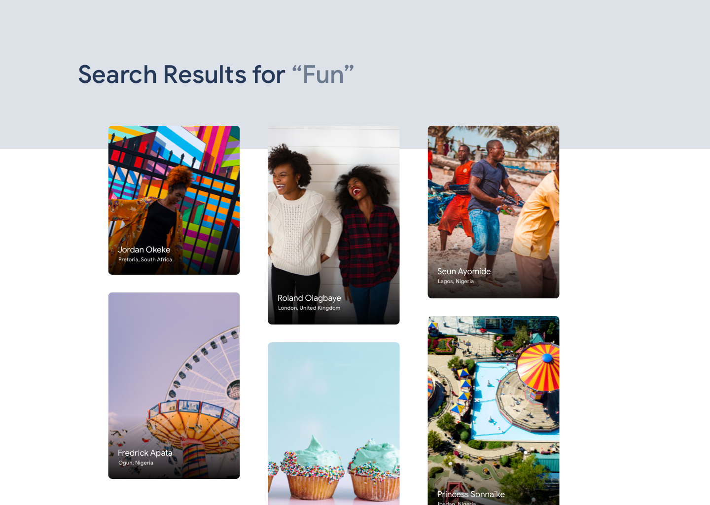
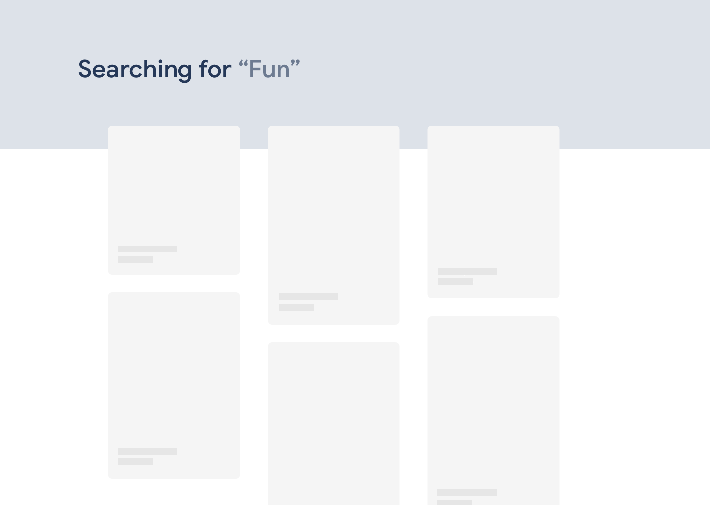
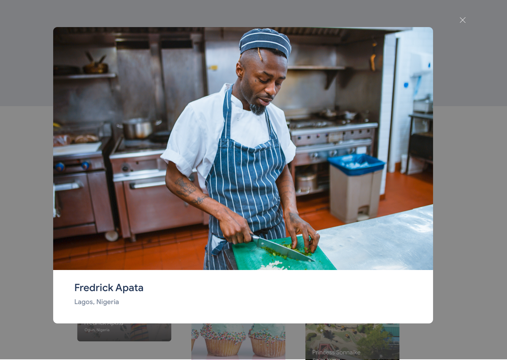

# Cowrywise Front End Engineer Test

[Link to Requirement](https://www.notion.so/cowrywise/Frontend-Engineer-Test-3a4aeb677c604ca9b41cdac102d2f974)

## Instruction

Using the [Unsplash API](https://unsplash.com/developers), you're to create a mini unsplash clone using the mockup given. See below for different parts of the mockup.

### Features

1. Users should see a landing latest african pictures
2. Users can search
3. Users should see a skeleton loader while waiting for results
4. Users can click on an image and see a modal showing a higher res.

### Mockup 1: Landing Screen shows 7 - 8 latest "African"

### Mockup 2: Search View

### Mockup 3: Loading Placeholders

### Mockup 4: Image Modal

## Project setup

This project is generated by [create-vue-app](https://github.com/vue-land/create-vue-app). To get started run the following.

- `yarn add`
- `yarn dev`

You can then visit the app in-browser; it defaults to http://localhost:4000
